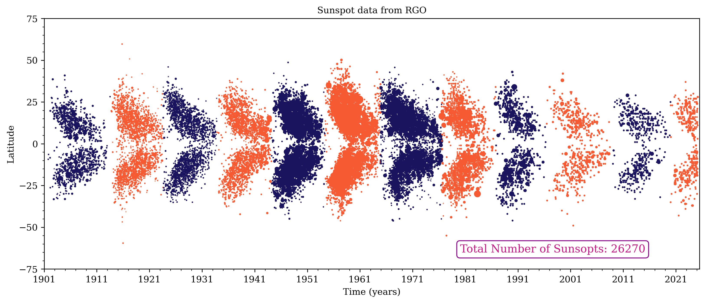
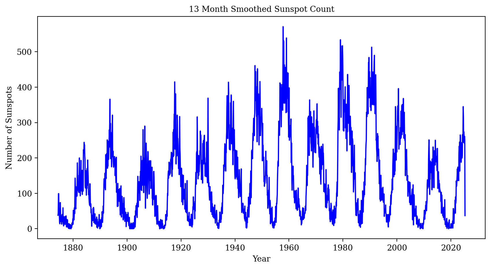

### Surface Flux Transport (SFT) model

[](https://doi.org/10.5281/zenodo.17459135)

Magnetic flux evolution on the solar/stellar surface is governed primarily by the large scale flows and flux cancellation.
It can be modelled by solving the magnetic induction in two dimension.
For a sun-like star where spherical geometry suits best to study the global surface flux distribution,
we can design a two dimensional SFT model with prescriptions of large-scale flow profiles and magnetic diffusivity for mimicing the
surface flux dynamics.

In this python-package, we develop a SFT model in 2D on a uniform latitude-longitude grid.

The model uses upwind-scheme for solving the advection terms and central difference scheme for diffusion terms with a forward euler scheme for time integration.

An example file is shared with the repository to test the model with basic parameter setting.

Feel free to modify and change the simulation parameters according to your requirements.

#### Installation instruction

The module is packaged to be installed with `pip`. It is recomended to create a `conda` enviornment specific to this module for testing.

1. Download a local copy (recomended for further testing/developing). If you are a collaborator you should have access to this repository.
   If you want to join us for development do let us know.

   ```
   git clone https://github.com/sr-dash/SFT2D.git
   ```

2. Create a new `conda` enviornment specific for `sft2d` package with

   ```
   conda env create -f environment.yml
   conda activate sft2d
   ```

3. Install the package with the following command.

   ```
   pip install git+https://github.com/sr-dash/SFT2D.git sft2d
   ```

   Since this is a private repository, you will need to access it with a personalized github token. You can create your own personalized token in your account developper settings.
   Let us know if you need help in this step.

After this you should be able to import sft2d module in any python enviornment or notebook.

#### An example file `example_run_packaged.py` is provided within the `sft2d/` directory to test your installed `sft2d` package.

### We are currently developing the model and in the process of packaging it as a software.

For now you can just download the whole repository and run the example.py file to test the simulation.

### To-Do List

1. **Add BMR Modelling**

   - Implement the BMR (Bipolar Magnetic Region) modeling functionality.
   - Integrate BMR modeling into the Surface Flux Transport (SFT) model.
   - Provide users with an option to enable or disable BMR modeling.

2. **BMR Data Processing**
   - Process BMR properties from various sources (RGO/HMI).
   - Create standardized tables for BMR modeling input.
   - Ensure compatibility of data formats across different sources.
3. **Data assimilation**
   - Develop routines for magnetogram data assimilation with interpolation.
   - Cases for different sources HMI or any other Stellar processed data.
   - Calibrate fluxes and add as a source term to the model.

### RGO Sunspot property processing.

Observed sunspot properties are recorded by RGO and can be found [here](http://www.solarcyclescience.com/activeregions.html). To drive the SFT model, we have processed the sunspot properties.
The plot shows the butterfly diagram


The sunspots are only considered at their maximum area record for any given group/noaa number.
A 13 month smoothed sunspot number is also plotted for reference.



The datafile of compiled sunspot properties can be downloaded from [here](sunspot_data_rgo_1901_2025.csv).

#### Stay tuned for further updates. Contact us to collaborate on any of the to-do lists.

Contact: Soumyaranjan Dash
Email: sdash@nso.edu
