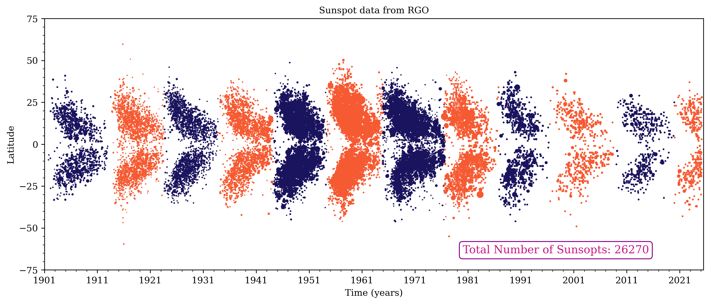
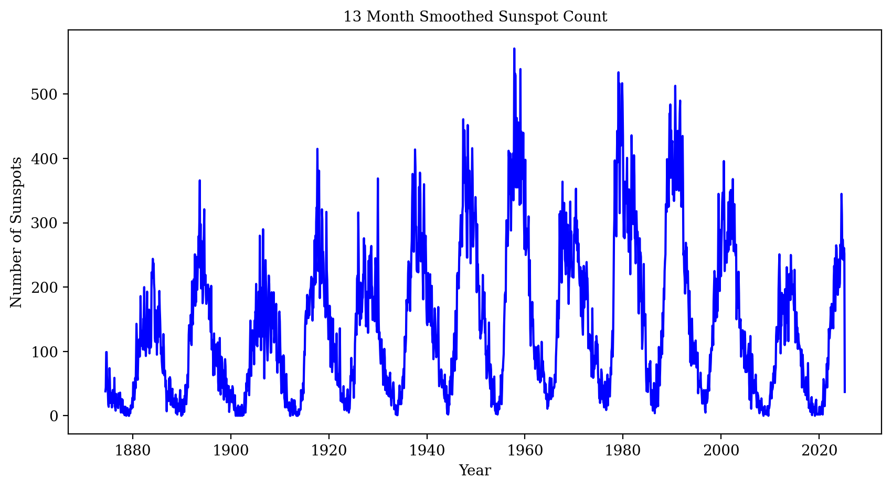

### Surface Flux Transport (SFT) model

[](https://doi.org/10.5281/zenodo.17459135)
[](https://github.com/sr-dash/SFT2D/actions/workflows/documentation.yml)

Magnetic flux evolution on the solar/stellar surface is governed primarily by the large scale flows and flux cancellation.
It can be modelled by solving the magnetic induction in two dimension.
For a sun-like star where spherical geometry suits best to study the global surface flux distribution,
we can design a two dimensional SFT model with prescriptions of large-scale flow profiles and magnetic diffusivity for mimicing the
surface flux dynamics.

In this python-package, we develop a SFT model in 2D on a spherical
finite-volume mesh (uniform in latitude and longitude).

#### Numerics

The model is a **finite-volume** solver on a pole-to-pole spherical mesh. Both
spatial operators are written in flux form on the exact cell areas, so the
area-weighted total flux is conserved to machine precision — there are no
boundary conditions at the poles, because the poles are ordinary cells
(spherical caps of angular radius `dtheta/2`).

| ingredient | scheme |
|---|---|
| mesh | cell-centred, pole to pole, `n_theta` cells including both polar caps; `n_phi` unique longitude cells (periodic) |
| advection | conservative MUSCL/TVD with selectable limiter (`vanleer` default; also `minmod`, `mc`, `superbee`, `upwind1`) |
| diffusion | conservative 5-point Laplacian, symmetric negative semi-definite |
| time integration | Strang splitting (advection → diffusion → advection) |
| advection in time | SSPRK(3,3), sub-cycled at its own CFL |
| diffusion in time | **RKL2 super-time-stepping**, which absorbs the stiff near-pole longitudinal limit in `O(sqrt)` stages |

Super-time-stepping matters because the longitudinal diffusion term carries an
explicit limit `dt < (R dphi sin(theta))^2 / eta` that collapses at the poles.
RKL2 removes it without the near-pole Fourier filtering that explicit SFT codes
normally resort to, so the discretisation stays faithful to the equation being
solved. At 181×360 a one-day step takes ~62 RKL2 stages in place of ~960
explicit diffusion steps.

Verified against analytic free decay of the axisymmetric modes
(`exp(-l(l+1) eta t / R^2)`, matched to better than 0.01% for l = 1, 2, 3);
run `pytest tests/` for the full suite.

An example file is shared with the repository to test the model with basic parameter setting.

Feel free to modify and change the simulation parameters according to your requirements.

#### Meridional-flow sign convention (read this once)

The solver advects the field with the **colatitude** velocity `u_theta`, and
`meridional_flow(grid, peak_speed)` returns exactly that. **Positive
`peak_speed` is poleward** — the physical case. In `u_theta` a poleward flow is
*negative in the north and positive in the south* (because `+theta` points
southward everywhere), which looks upside-down only because it is the
colatitude component. To plot the flow the intuitive way (northward-positive,
so poleward is `+` in the north and `−` in the south) use
`meridional_flow_latitude`.

A **negative** `peak_speed` is equatorward and will *prevent* polar reversal —
do not flip the sign expecting to fix a reversal problem; that is a
flux-amplitude / tilt question. See `examples/validate_against_hmi.py`, which
reverses the cycle-24 north pole with `+v0` and fails to with `−v0`.

#### Installation

The package builds from `pyproject.toml` (PEP 621) with a static version — no
git checkout is required to install.

Conda (recommended — creates the env and installs the package editable):

```bash
conda env create -f environment.yml
conda activate sft2d
```

or plain pip from a local checkout:

```bash
pip install -e .            # runtime only
pip install -e ".[dev]"     # + pytest, build, ruff, jupyter
```

Reference data (the processed RGO active-region record, an HMI synoptic map, and
HMI polar-field / butterfly references) ships **inside** the package at
`sft2d/data/`, so examples and the HMI comparison work from an installed copy:

```python
from sft2d.data import RGO_CSV, load_hmi_polar_field, load_hmi_butterfly
```

#### Testing your installation

A one-command smoke test that prints grid extent, area closure, RKL2 stage /
advection sub-cycle counts and the conservation + polar-field diagnostics:

```bash
python -m sft2d.example_run
```

The numerical test suite (mesh closure, flux conservation, operator symmetry,
analytic decay rates, TVD monotonicity, second-order convergence of the
polar-cap diagnostics, plus the meridional-flow convention and RGO-driver
end-to-end checks):

```bash
pytest                    # all tests
pytest -m "not slow"      # skip the multi-year driven-run tests (fast)
```

#### Examples

Runnable scripts in `examples/` (each uses the bundled data and writes a PNG):

```bash
python examples/numerical_diffusion_test.py     # limiter peak-retention
python examples/bmr_demo.py                      # flux-normalised Joy/Hale BMRs
python examples/run_driven_cycle.py 2010 2020 30 # RGO-driven butterfly + polar field
python examples/validate_against_hmi.py 15       # cycle-24 reversal vs HMI
```

The notebook `docs/notebooks/example-run.ipynb` walks through the same material
interactively.

#### Cycle-24 validation

Driving the model from the bundled RGO record over cycle 24 reproduces the
observed HMI north-cap polar-field reversal in both **sign and timing** (run
`python examples/validate_against_hmi.py 15`). Two things have to be right for
the pole to reverse to the observed sign:

* the meridional flow must be **poleward** (`peak_speed > 0`); and
* the **Hale polarity** must match the real cycle (odd cycles: N leading `+`;
  even cycles: N leading `-`). The absolute Hale parity is now anchored to the
  observed cycles rather than left arbitrary — with it inverted, the pole
  reversed to the *wrong* sign even though the transport was correct.

### To-Do List

1. **Calibration harness** — a parameter scan over (`flux_scale`, `eta`, `v0`)
   minimising the polar-cap-flux misfit against the HMI reference. The forward
   model, the diagnostics and the HMI reference data are all in place (see
   `examples/validate_against_hmi.py` and `sft2d.data`); what remains is the
   objective + scan driver.
2. **Data assimilation** — the `assimilate=` hook in `evolve` is already in
   place; what is missing is the callable that inserts observed B_r in a
   low-latitude window each Carrington rotation with flux balancing.
3. **Performance** — the operators are pure NumPy and cache their geometry,
   giving ~5 s per simulated year at 91×180 and ~45 s/yr at 181×360 on a laptop.
   A parameter scan is embarrassingly parallel across evaluations; run them in
   separate processes rather than threading the solver.

### RGO Sunspot property processing.

Observed sunspot properties are recorded by RGO and can be found [here](http://www.solarcyclescience.com/activeregions.html). To drive the SFT model, we have processed the sunspot properties.
The plot shows the butterfly diagram


The sunspots are only considered at their maximum area record for any given group/noaa number.
A 13 month smoothed sunspot number is also plotted for reference.



The datafile of compiled sunspot properties can be downloaded from [here](sunspot_data_rgo_1901_2025.csv).

#### Stay tuned for further updates. Contact us to collaborate on any of the to-do lists.

Contact: Soumyaranjan Dash
Email: sdash@nso.edu
